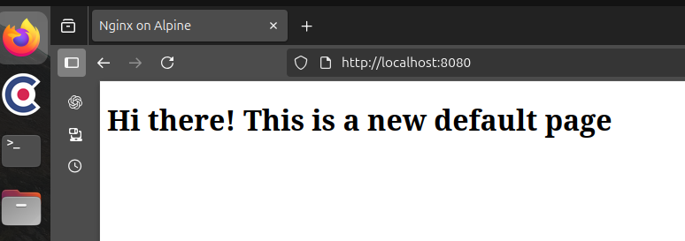

### ДЗ-19 Docker
Цель домашнего задания  
Освоить базовые принципы работы с Docker, научиться создавать, настраивать и управлять контейнерами
##### Описание домашнего задания
1. Установите Docker на хост машину https://docs.docker.com/engine/install/ubuntu/
2. Установите Docker Compose - как плагин, или как отдельное приложение
3. Создайте свой кастомный образ nginx на базе alpine. 
После запуска nginx должен отдавать кастомную страницу (достаточно изменить дефолтную страницу nginx)
4. Определите разницу между контейнером и образом. Вывод опишите в домашнем задании.
5. Ответьте на вопрос: Можно ли в контейнере собрать ядро?

#### 1. Установка docker
Переходим на страницу https://docs.docker.com/engine/install/ubuntu/#install-using-the-convenience-script 
скачиваем и запускаем скрипт установки docker
```
curl -fsSL https://get.docker.com -o get-docker.sh
sudo sh get-docker.sh
Executing docker install script, commit: 7cae5f8b0decc17d6571f9f52eb840fbc13b2737
<...>
```
Проверяем установку:
```
user@u22ws:~$ docker version
Client: Docker Engine - Community
 Version:           28.4.0
 API version:       1.51
 Go version:        go1.24.7
 Git commit:        d8eb465
 Built:             Wed Sep  3 20:57:20 2025
 OS/Arch:           linux/amd64
 Context:           default

Server: Docker Engine - Community
 Engine:
  Version:          28.4.0
  API version:      1.51 (minimum version 1.24)
  Go version:       go1.24.7
  Git commit:       249d679
  Built:            Wed Sep  3 20:57:20 2025
  OS/Arch:          linux/amd64
  Experimental:     false
 containerd:
  Version:          1.7.27
  GitCommit:        05044ec0a9a75232cad458027ca83437aae3f4da
 runc:
  Version:          1.2.5
  GitCommit:        v1.2.5-0-g59923ef
 docker-init:
  Version:          0.19.0
  GitCommit:        de40ad0
```
#### 2. Устанавливаем docker-compose как плагин
Проверяем последнюю версию плагина: 
```
user@u22ws:~/otus/hw-19$ curl -s https://api.github.com/repos/docker/compose/releases/latest | grep 'tag_name'
  "tag_name": "v2.39.3",
```
  Устанавливаем в /usr/bin/docker:
```
  user@u22ws:~/otus/hw-19$ sudo curl -L "https://github.com/docker/compose/releases/download/"v2.39.3"/docker-compose-$(uname -s)-$(uname -m)" -o /usr/bin/docker-compose
[sudo] password for user: 
  % Total    % Received % Xferd  Average Speed   Time    Time     Time  Current
                                 Dload  Upload   Total   Spent    Left  Speed
  0     0    0     0    0     0      0      0 --:--:-- --:--:-- --:--:--     0
100 72.8M  100 72.8M    0     0  9281k      0  0:00:08  0:00:08 --:--:-- 10.4M
user@u22ws:~/otus/hw-19$ sudo chmod +x /usr/bin/docker-compose
user@u22ws:~/otus/hw-19$ docker-compose --version
Docker Compose version v2.39.3
user@u22ws:~/otus/hw-19$ 
```
#### 3. Создаем свой кастомный образ nginx на базе alpine. После запуска nginx должен отдавать кастомную страницу (достаточно изменить дефолтную страницу nginx)  

Создаем директорию для домашнего задания
```
mkdir -p otus/hw-19
cd otus/hw-19
user@u22ws:~/otus/hw-19$ pwd
/home/user/otus/hw-19
```
Создаем простой Dockerfile, nginx.conf, index.html  
Собираем контейнер
```
user@u22ws:~/otus/hw-19$ docker build -t nginx-hw-19:v0 .
[+] Building 1.5s (10/10) FINISHED                                                                                                                                             docker:default
 => [internal] load build definition from Dockerfile                                                                                                                                    0.0s
 => => transferring dockerfile: 608B                                                                                                                                                    0.0s
 => [internal] load metadata for docker.io/library/alpine:latest                                                                                                                        1.3s
 => [internal] load .dockerignore                                                                                                                                                       0.0s
 => => transferring context: 2B                                                                                                                                                         0.0s
 => [1/5] FROM docker.io/library/alpine:latest@sha256:4bcff63911fcb4448bd4fdacec207030997caf25e9bea4045fa6c8c44de311d1                                                                  0.0s
 => [internal] load build context                                                                                                                                                       0.0s
 => => transferring context: 1.04kB                                                                                                                                                     0.0s
 => CACHED [2/5] RUN apk update && apk add --no-cache nginx                                                                                                                             0.0s
 => CACHED [3/5] RUN mkdir -p /run/nginx /usr/share/nginx/html                                                                                                                          0.0s
 => [4/5] COPY index.html /usr/share/nginx/html/index.html                                                                                                                              0.0s
 => [5/5] COPY nginx.conf /etc/nginx/nginx.conf                                                                                                                                         0.0s
 => exporting to image                                                                                                                                                                  0.0s
 => => exporting layers                                                                                                                                                                 0.0s
 => => writing image sha256:5db92ad3702ff41794a4f22f33a6d96a0e120fda5e2822f1107c453523961a88                                                                                            0.0s
 => => naming to docker.io/library/nginx-hw-19:v0                                                                                                                                       0.0s
user@u22ws:~/otus/hw-19$ 
```
Запускаем контейнер  
```
user@u22ws:~/otus/hw-19$ docker run -d -p 8080:80 nginx-hw-19:v0 
a26d050afd35b5d23b9352b5d4cc4702906f740b2e5449ce670a052f002f7dce
user@u22ws:~/otus/hw-19$ docker ps
CONTAINER ID   IMAGE     COMMAND   CREATED   STATUS    PORTS     NAMES
user@u22ws:~/otus/hw-19$ 
```
Упс... не запустился :(  
Смотрим лог
```
user@u22ws:~/otus/hw-19$ docker logs 17b5839435cf00d18d061f447352798f970dd611f1b5e0aa2f54841f13149a7e
nginx: [emerg] unexpected end of file, expecting "}" in /etc/nginx/nginx.conf:28
nginx: [emerg] unexpected end of file, expecting "}" in /etc/nginx/nginx.conf:28
user@u22ws:~/otus/hw-19$
```
Ошибка в конфигурационном файле. Добавлям недостающую закрывающую скобку и пересобираем образ
```
user@u22ws:~/otus/hw-19$ docker stop 630dcc7fa70dffdd16
630dcc7fa70dffdd16
user@u22ws:~/otus/hw-19$ docker rm 630dcc7fa70dffdd16
630dcc7fa70dffdd16
```
Удаляем образ
```
user@u22ws:~/otus/hw-19$ docker images
REPOSITORY    TAG       IMAGE ID       CREATED          SIZE
nginx-hw-19   v0        5db92ad3702f   24 minutes ago   12.8MB
nginx-hw-18   v0        e66d2086ab00   24 hours ago     12.8MB
hello-world   latest    1b44b5a3e06a   5 weeks ago      10.1kB
user@u22ws:~/otus/hw-19$ docker rmi 5db92ad3702f
Untagged: nginx-hw-19:v0
Deleted: sha256:5db92ad3702ff41794a4f22f33a6d96a0e120fda5e2822f1107c453523961a88
user@u22ws:~/otus/hw-19$ 
```
Проверяем удаление 
```
user@u22ws:~/otus/hw-19$ docker images
REPOSITORY    TAG       IMAGE ID       CREATED        SIZE
hello-world   latest    1b44b5a3e06a   5 weeks ago    10.1kB
```
Сборка
```
user@u22ws:~/otus/hw-19$ !196
docker build -t nginx-hw-19:v0 .
[+] Building 1.6s (10/10) FINISHED                                                                                                                                             docker:default
 => [internal] load build definition from Dockerfile                                                                                                                                    0.0s
 => => transferring dockerfile: 608B                                                                                                                                                    0.0s
 => [internal] load metadata for docker.io/library/alpine:latest                                                                                                                        1.5s
 => [internal] load .dockerignore                                                                                                                                                       0.0s
 => => transferring context: 2B                                                                                                                                                         0.0s
 => [1/5] FROM docker.io/library/alpine:latest@sha256:4bcff63911fcb4448bd4fdacec207030997caf25e9bea4045fa6c8c44de311d1                                                                  0.0s
 => [internal] load build context                                                                                                                                                       0.0s
 => => transferring context: 893B                                                                                                                                                       0.0s
 => CACHED [2/5] RUN apk update && apk add --no-cache nginx                                                                                                                             0.0s
 => CACHED [3/5] RUN mkdir -p /run/nginx /usr/share/nginx/html                                                                                                                          0.0s
 => CACHED [4/5] COPY index.html /usr/share/nginx/html/index.html                                                                                                                       0.0s
 => [5/5] COPY nginx.conf /etc/nginx/nginx.conf                                                                                                                                         0.0s
 => exporting to image                                                                                                                                                                  0.0s
 => => exporting layers                                                                                                                                                                 0.0s
 => => writing image sha256:d13ffad72fe7d64eac646d9eb07ab1e1f410ae0c7b597e1b50725a6b13732746                                                                                            0.0s
 => => naming to docker.io/library/nginx-hw-19:v0                                                                                                                                       0.0s
```
Запускаем
```
user@u22ws:~/otus/hw-19$ docker run -d -p 8080:80 nginx-hw-19:v0
03f8ed92e09b2acfd50e74ad739b28030c21c1a21d6219f7ee7cbaaaf3ac98dc
user@u22ws:~/otus/hw-19$ 
user@u22ws:~/otus/hw-19$ docker ps 
CONTAINER ID   IMAGE            COMMAND                  CREATED         STATUS         PORTS                                     NAMES
03f8ed92e09b   nginx-hw-19:v0   "nginx -g 'daemon of…"   6 seconds ago   Up 5 seconds   0.0.0.0:8080->80/tcp, [::]:8080->80/tcp   priceless_keller
user@u22ws:~/otus/hw-19$ 
```
Контейнер стартовал успешно. Проверяем начальную страницу http://localhost:8080


#### 4. Определите разницу между контейнером и образом


🔹 Образ (image)

Это шаблон (набор слоёв файловой системы + метаданные).

Он неизменяемый: после сборки образа его содержимое не меняется.

Используется для запуска контейнеров.

Можно сравнить с ISO-образом ОС или «снимком» программы: сам по себе образ не работает.

Пример:
nginx:latest — это образ, содержащий Nginx и всё необходимое окружение.

🔹 Контейнер (container)

Это запущенный экземпляр образа.

Контейнер работает изолированно, имеет собственное файловое пространство, процессы, сетевые интерфейсы.

В отличие от образа, контейнер изменяемый: внутри можно создавать/удалять файлы, запускать процессы.

Можно остановить, перезапустить или удалить.

Пример:
Когда вы выполняете docker run nginx:latest, создаётся контейнер на основе образа nginx:latest.

#### 5. Вывод опишите в домашнем задании
Dockerfile = чертёж, проектная документация для строительства дома.

Образ = полный комплект материалов для строительства дома, причем они уложены слоями в том порядке, в котором будут использоваться.

Контейнер = дом, построенный по этому проекту из материалов образа, используя материалы по порядку слоев.

#### 6. Ответьте на вопрос: Можно ли в контейнере собрать ядро?
Нет. В отличие от виртуальной машины контейнер использует ресурсы хоста напрямую, он просто изолирован от других процессов хоста. Можно проверить через версию операционной системы:
```
user@u22ws:~/otus/hw-19$ docker exec -it 03f8ed92e09b2acf sh

/ # cat /proc/version
Linux version 6.14.0-29-generic (buildd@lcy02-amd64-033) (x86_64-linux-gnu-gcc-14 (Ubuntu 14.2.0-19ubuntu2) 14.2.0, GNU ld (GNU Binutils for Ubuntu) 2.44) #29-Ubuntu SMP PREEMPT_DYNAMIC Thu Aug  7 18:32:38 UTC 2025
/ # 
```
В выводе команды видно, что операционная система - Ubuntu, тогда как в контейнере - Alpine

### ДЗ-19 выполнено

